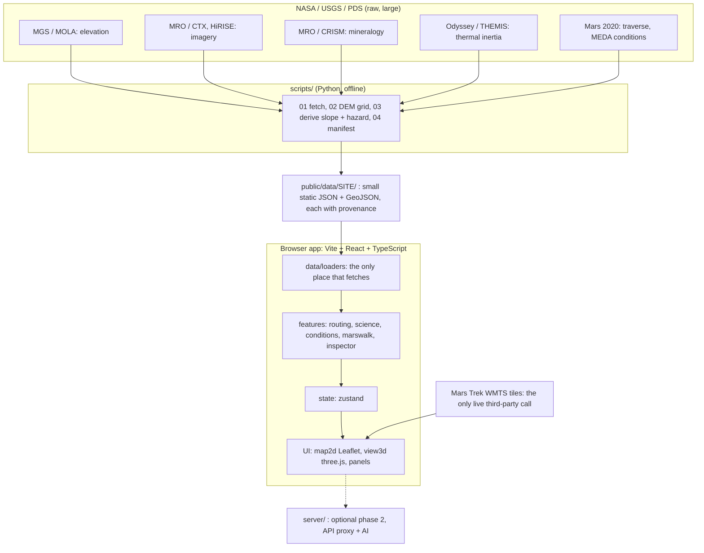

# ARCHITECTURE

## 1. Big picture
```
 NASA / USGS / PDS products (raw, large)
            |  scripts/ (Python, offline)     <- fetch, crop, resample, derive slope/hazard
            v
   public/data/<site>/*.json|geojson + manifest.json   (small, static, versioned)
            |  served as static files
            v
 +------------------- Browser app (Vite + React + TypeScript) -------------------+
 |  data/loaders  ->  lib (pure math)  ->  features/{routing,science,...}        |
 |        |                                   |                                  |
 |        +-------------- state (zustand) ----+                                  |
 |                          |                                                    |
 |            map2d (Leaflet)      view3d (three.js via react-three-fiber)       |
 |                          \\           /                                       |
 |                        panels: layers, route, target, conditions, plan        |
 +-------------------------------------------------------------------------------+
   (optional phase 2) server/ : API proxy + AI assistant
```

### 1a. Diagram (Mermaid - renders on GitHub/GitLab; the ASCII above is the fallback)


### 1b. Layer model (one row per entry in `config/layers.config.ts`)
| Layer id | Mission / instrument | Source | Drawn by `MapView` today? |
|---|---|---|---|
| `basemap-imagery` | MRO CTX / HiRISE | tile URL (`VITE_TILE_BASEMAP_URL`) | yes (needs URL) |
| `elevation` | MGS MOLA | tile URL (`VITE_TILE_ELEVATION_URL`) | yes (needs URL) |
| `slope` | MGS MOLA, derived | grid `jezero-delta/slope.json` | no - grid overlay is T-023 |
| `mineralogy` | MRO CRISM | geojson `jezero-delta/mineralogy.geojson` | yes (needs file) |
| `thermal-inertia` | ODY THEMIS | grid `jezero-delta/thermal_inertia.json` | no - T-023 |
| `rover-traverse` | Mars 2020 | geojson `jezero-delta/traverse.geojson` | yes (needs file) |
| `science-targets` | Mars 2020, curated | geojson `jezero-delta/targets.geojson` | yes (needs file) |
| `hazards` | derived | grid `jezero-delta/hazard.json` | no - T-023 |

"Integrated" means the same data answers a point query: the inspector (`features/inspector`, ADR-015) reads the DEM grid, targets and traverse and reports them together for any clicked point.

## 2. Layers of the code (dependency rule: arrows only point downward)
1. `app/`, `features/*/*Panel.tsx`, `map2d`, `view3d` - UI
2. `features/*/*.ts` (routing, science, conditions, marswalk) - domain logic
3. `state/`, `hooks/` - glue
4. `data/loaders`, `data/sources` - I/O (only place that calls `fetch`)
5. `lib/`, `config/`, `types/` - pure, dependency-free

`lib/` must not import from `features/`. `features/X` must not import from `features/Y` internals (use `types/` or `state/`). Three.js is imported **only** in `features/view3d`.

## 3. Directory map
```
working_toolkit/                 <- project root
  README.md  AGENTS.md  CLAUDE.md  package.json  tsconfig.json  vite.config.ts
  index.html  .env.example  .gitignore  .editorconfig  .prettierrc
  docs/                          <- all specs (this folder)
  data/raw|interim/              <- big/temporary files, gitignored
  scripts/                       <- Python data pipeline
  server/                        <- optional phase 2 backend
  tests/unit|fixtures/           <- vitest
  public/                        <- static: favicon, data/, models/, textures/
  .github/workflows/ci.yml
  src/
    main.tsx  vite-env.d.ts
    app/            App shell
    config/         constants, sites, layers registry
    types/          shared TypeScript types (Provenance, LayerDef, ...)
    state/          zustand store
    hooks/          React hooks (useTerrainGrid, useSiteVectors)
    styles/         tokens.css, global.css
    assets/         small bundled images
    workers/        web workers (routing)
    lib/{geo,units,math}/   pure functions
    data/{sources,loaders}/ I/O
    features/
      layers/  map2d/  view3d/  routing/  science/  inspector/
      conditions/  marswalk/  provenance/  assistant/(optional)
```
Where new things go -> `AGENTS.md` section 5.

## 4. Technology choices (why: `DECISIONS.md`)
| Concern | Choice |
|---|---|
| Build/dev | Vite, TypeScript strict |
| UI | React 19 |
| 2D map | Leaflet with `L.CRS.EPSG4326` (lon/lat tiles; ADR-004) |
| 3D | three.js + @react-three/fiber + drei (ADR-005) |
| State | zustand (ADR-011) |
| Tests | vitest |
| Data prep | Python (numpy, rasterio, pyproj, shapely) (ADR-012) |
| Hosting | any static host |

## 5. Data flow at runtime
1. App loads `/data/manifest.json` -> knows which assets exist for the site.
2. Loaders fetch DEM/GeoJSON; `useTerrainGrid` falls back to **synthetic terrain (flagged)** if no DEM.
3. Layer registry + store decide what the map draws.
4. Routing: grid + slope + hazard + science -> A* -> `RouteResult` in store.
5. 2D, 3D, and plan panels all read the same `RouteResult`.

## 6. Performance
Tiles for imagery (never ship huge rasters); DEM grid 512x512 max (~1 MB base64); 3D lazy-loaded; move A* to `routing.worker.ts` when slow; memoise geometry.

## 7. Security and privacy
No accounts, no personal data, no secrets in the bundle. Third-party keys only in server env (phase 2). Sanitise anything rendered from external text.

## 8. Deployment
`npm run build` -> `dist/` -> static host. CI runs `npm run check` + build.

## 9. Extension points
New layer: registry entry + data file. New site: `sites.config.ts` + `scripts/common.py` + manifest. New route profile: `costModel.ts`. New model asset: `public/models/`.
